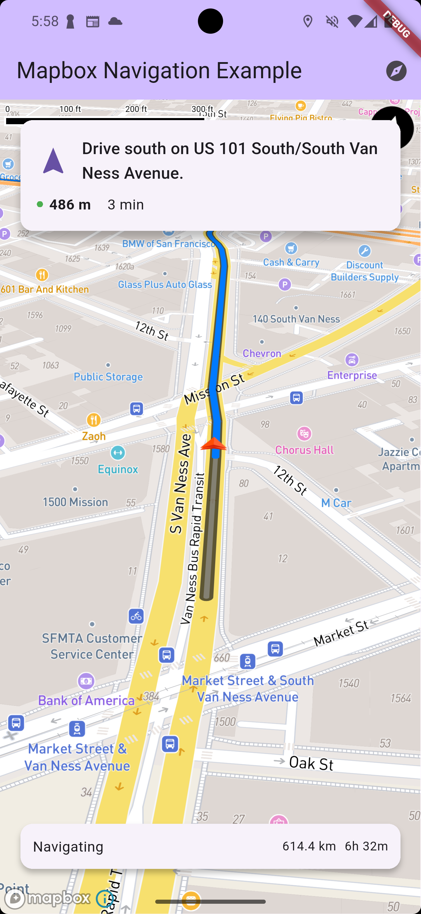

# Mapbox Navigation

A minimal, lightweight Flutter package that provides 3D turn-by-turn navigation using Mapbox APIs. This package offers a clean, dependency-minimal approach to navigation with an FPS-style dynamic camera and comprehensive customization options.



## Features

### Core navigation
- **3D Turn-by-Turn Navigation**: Real-time navigation with step-by-step instructions
- **FPS-Style Camera**: Dynamic 3D camera that follows the user with pitch, bearing, and zoom controls
- **Route Calculation**: Powered by Mapbox Directions API with support for multiple profiles
- **Real-time Location Tracking**: GPS-based location services with simulation support for testing
- **Route Visualization**: Beautiful route rendering on the map with traffic data support
- Fully compatible with Mapbox Maps Flutter SDK

### Advanced features
- **Voice Instructions**: Text-to-speech navigation announcements with customizable settings
- **Traffic Data Integration**: Real-time traffic information for optimized routing
- **Localization Support**: Multi-language support for navigation instructions
- **Waypoint Support**: Navigate through multiple stops along your route
- **Route Recalculation**: Automatic rerouting when off-course
- **Customizable UI**: Build your own instruction widgets and overlays

### Developer-friendly
- **Minimal Dependencies**: Only essential packages (mapbox_maps_flutter, geolocator, http, flutter_tts)
- **Clean API**: Simple widget-based integration with comprehensive callbacks
- **Simulation Mode**: Test navigation without GPS using route simulation
- **Error Handling**: Robust error management with detailed error reporting
- **Stream-based Architecture**: Reactive programming with real-time state updates

## Installation

Add this package to your `pubspec.yaml`:

```yaml
dependencies:
  mapbox_navigation: ^0.1.0
```

Then run:

```bash
flutter pub get
```

### Platform Setup

#### iOS
Add the following to your `ios/Runner/Info.plist`:

```xml
<key>NSLocationWhenInUseUsageDescription</key>
<string>This app needs location access for navigation.</string>
<key>NSLocationAlwaysAndWhenInUseUsageDescription</key>
<string>This app needs location access for navigation.</string>
```

#### Android
Add the following permissions to your `android/app/src/main/AndroidManifest.xml`:

```xml
<uses-permission android:name="android.permission.ACCESS_FINE_LOCATION" />
<uses-permission android:name="android.permission.ACCESS_COARSE_LOCATION" />
<uses-permission android:name="android.permission.INTERNET" />
```

## Quick Start

### Basic Navigation

```dart
import 'package:flutter/material.dart';
import 'package:mapbox_navigation/mapbox_navigation.dart';

class NavigationScreen extends StatefulWidget {
  @override
  _NavigationScreenState createState() => _NavigationScreenState();
}

class _NavigationScreenState extends State<NavigationScreen> {
  NavigationController? _navigationController;

  @override
  Widget build(BuildContext context) {
    return Scaffold(
      body: MapboxNavigationView(
        accessToken: 'YOUR_MAPBOX_ACCESS_TOKEN',
        onMapReady: (controller) {
          _navigationController = controller;
        },
        onNavigationStateChanged: (state) {
          print('Navigation state: ${state.status}');
        },
        onStepChanged: (step) {
          print('Next instruction: ${step.instruction}');
        },
      ),
      floatingActionButton: FloatingActionButton(
        onPressed: _startNavigation,
        child: Icon(Icons.navigation),
      ),
    );
  }

  void _startNavigation() async {
    if (_navigationController != null) {
      await _navigationController!.startNavigation(
        origin: Waypoint(
          latitude: 37.7749,
          longitude: -122.4194,
          name: 'San Francisco',
        ),
        destination: Waypoint(
          latitude: 37.7849,
          longitude: -122.4094,
          name: 'Destination',
        ),
      );
    }
  }
}
```

### With voice instructions

```dart
MapboxNavigationView(
  accessToken: 'YOUR_MAPBOX_ACCESS_TOKEN',
  voiceSettings: VoiceSettings(
    enabled: true,
    language: 'en-US',
    speechRate: 0.5,
    volume: 1.0,
  ),
  onVoiceInstruction: (instruction) {
    print('Voice: $instruction');
  },
  // ... other properties
)
```

### With traffic data

```dart
MapboxNavigationView(
  accessToken: 'YOUR_MAPBOX_ACCESS_TOKEN',
  enableTrafficData: true, // Uses driving-traffic profile
  // ... other properties
)
```

## Advanced usage

### Custom instruction widget

```dart
MapboxNavigationView(
  accessToken: 'YOUR_MAPBOX_ACCESS_TOKEN',
  showInstructions: false, // Disable default instructions
  instructionBuilder: (step) {
    return Container(
      padding: EdgeInsets.all(16),
      decoration: BoxDecoration(
        color: Colors.blue,
        borderRadius: BorderRadius.circular(8),
      ),
      child: Column(
        children: [
          Icon(_getManeuverIcon(step.maneuver), color: Colors.white),
          SizedBox(height: 8),
          Text(
            step.instruction,
            style: TextStyle(color: Colors.white, fontSize: 16),
          ),
          Text(
            '${step.distance.toInt()}m',
            style: TextStyle(color: Colors.white70, fontSize: 14),
          ),
        ],
      ),
    );
  },
)
```

### Multiple Waypoints

```dart
await _navigationController!.startNavigation(
  origin: Waypoint(latitude: 37.7749, longitude: -122.4194),
  destination: Waypoint(latitude: 37.7949, longitude: -122.3994),
  stops: [
    Waypoint(latitude: 37.7849, longitude: -122.4094, name: 'Stop 1'),
    Waypoint(latitude: 37.7899, longitude: -122.4044, name: 'Stop 2'),
  ],
  profile: 'driving-traffic', // Use traffic-optimized routing
);
```

### Route Simulation (for Testing)

```dart
MapboxNavigationView(
  accessToken: 'YOUR_MAPBOX_ACCESS_TOKEN',
  simulationSpeed: 15.0, // 15 m/s simulation speed
  // ... other properties
)

// Start simulation
await _navigationController!.startSimulation(
  route: routePositions, // List<Position>
  speed: 20.0, // m/s
);
```

### Localization

```dart
MapboxNavigationView(
  accessToken: 'YOUR_MAPBOX_ACCESS_TOKEN',
  language: 'es', // Spanish instructions
  voiceSettings: VoiceSettings(
    enabled: true,
    language: 'es-ES', // Spanish voice
  ),
)
```

Important: You need to add add the `NavigationLocalizations.delegate` to your `MaterialApp`'s `localizationsDelegates` list.

```dart
MaterialApp(
  localizationsDelegates: [
    NavigationLocalizations.delegate,
    // ... other delegates
  ],
  // ... other properties
)
```

## API Reference

### MapboxNavigationView

The main widget for displaying navigation.

#### Properties

| Property | Type | Description | Default |
|----------|------|-------------|---------|
| `accessToken` | `String` | Mapbox access token (required) | - |
| `initialCameraPosition` | `CameraOptions?` | Initial camera position | `null` |
| `styleUri` | `String?` | Map style URI | Mapbox default |
| `showInstructions` | `bool` | Show default instruction overlay | `true` |
| `enableTrafficData` | `bool` | Enable traffic data for routing | `false` |
| `voiceSettings` | `VoiceSettings?` | Voice instruction configuration | `null` |
| `language` | `String` | Language for instructions | `'en'` |
| `simulationSpeed` | `double` | Simulation speed in m/s | `10.0` |

#### Callbacks

| Callback | Type | Description |
|----------|------|-------------|
| `onMapReady` | `MapReadyCallback?` | Called when map and navigation controller are ready |
| `onNavigationStateChanged` | `NavigationCallback?` | Called when navigation state changes |
| `onStepChanged` | `StepCallback?` | Called when navigation step changes |
| `onError` | `ErrorCallback?` | Called when an error occurs |
| `onVoiceInstruction` | `VoiceInstructionCallback?` | Called when voice instruction is spoken |
| `instructionBuilder` | `Widget Function(NavigationStep)?` | Custom instruction widget builder |

### NavigationController

Controls navigation behavior and state.

#### Methods

```dart
// Start navigation
Future<void> startNavigation({
  required Waypoint origin,
  required Waypoint destination,
  List<Waypoint>? stops,
  String profile = 'driving',
  bool? enableTrafficData,
  VoiceSettings? voiceSettings,
});

// Stop navigation
Future<void> stopNavigation();

// Pause/resume navigation
Future<void> pauseNavigation();
Future<void> resumeNavigation();

// Recalculate route
Future<void> recalculateRoute();

// Simulation methods
Future<void> startSimulation(List<Position> route, {double speed});
void stopSimulation();
```

#### Properties

```dart
// Current state
NavigationState get currentState;
RouteData? get currentRoute;

// Status checks
bool get isNavigating;
bool get hasArrived;
bool get isVoiceEnabled;

// Streams
Stream<NavigationState> get stateStream;
Stream<NavigationStep> get stepStream;
```

### Models

#### Waypoint

```dart
class Waypoint {
  final double latitude;
  final double longitude;
  final double? altitude;
  final String? name;
  
  // Factory constructors
  factory Waypoint.fromPosition(Position position, {String? name});
}
```

#### NavigationState

```dart
enum NavigationStatus {
  idle, calculating, navigating, paused, arrived, error
}

class NavigationState {
  final NavigationStatus status;
  final RouteData? route;
  final Waypoint? currentPosition;
  final String? errorMessage;
}
```

#### VoiceSettings

```dart
class VoiceSettings {
  final bool enabled;
  final double speechRate; // 0.3 to 1.0
  final double pitch; // 0.5 to 2.0
  final double volume; // 0.0 to 1.0
  final String language; // e.g., 'en-US', 'es-ES'
  final List<double> announcementDistances; // [500.0, 200.0, 50.0]
  
  // Factory constructors
  factory VoiceSettings.defaults({String? language});
  factory VoiceSettings.highway({String? language});
}
```

## Examples

### Complete navigation app

```dart
import 'package:flutter/material.dart';
import 'package:mapbox_navigation/mapbox_navigation.dart';

class FullNavigationApp extends StatefulWidget {
  @override
  _FullNavigationAppState createState() => _FullNavigationAppState();
}

class _FullNavigationAppState extends State<FullNavigationApp> {
  NavigationController? _controller;
  NavigationState _currentState = NavigationState.idle();
  NavigationStep? _currentStep;

  @override
  Widget build(BuildContext context) {
    return Scaffold(
      body: Stack(
        children: [
          MapboxNavigationView(
            accessToken: 'YOUR_MAPBOX_ACCESS_TOKEN',
            enableTrafficData: true,
            voiceSettings: VoiceSettings.defaults(),
            onMapReady: (controller) => _controller = controller,
            onNavigationStateChanged: (state) {
              setState(() => _currentState = state);
            },
            onStepChanged: (step) {
              setState(() => _currentStep = step);
            },
            instructionBuilder: _buildCustomInstruction,
          ),
          _buildNavigationControls(),
          if (_currentState.status == NavigationStatus.navigating)
            _buildNavigationInfo(),
        ],
      ),
    );
  }

  Widget _buildCustomInstruction(NavigationStep step) {
    return Positioned(
      top: 50,
      left: 16,
      right: 16,
      child: Card(
        child: Padding(
          padding: EdgeInsets.all(16),
          child: Row(
            children: [
              Icon(_getManeuverIcon(step.maneuver), size: 32),
              SizedBox(width: 16),
              Expanded(
                child: Column(
                  crossAxisAlignment: CrossAxisAlignment.start,
                  children: [
                    Text(
                      step.instruction,
                      style: TextStyle(fontSize: 16, fontWeight: FontWeight.bold),
                    ),
                    Text('${step.distance.toInt()}m'),
                  ],
                ),
              ),
            ],
          ),
        ),
      ),
    );
  }

  Widget _buildNavigationControls() {
    return Positioned(
      bottom: 100,
      right: 16,
      child: Column(
        children: [
          FloatingActionButton(
            heroTag: 'start',
            onPressed: _startNavigation,
            child: Icon(Icons.navigation),
          ),
          SizedBox(height: 8),
          if (_currentState.status == NavigationStatus.navigating)
            FloatingActionButton(
              heroTag: 'stop',
              onPressed: () => _controller?.stopNavigation(),
              child: Icon(Icons.stop),
              backgroundColor: Colors.red,
            ),
        ],
      ),
    );
  }

  Widget _buildNavigationInfo() {
    final route = _currentState.route;
    if (route == null) return SizedBox();

    return Positioned(
      bottom: 16,
      left: 16,
      right: 16,
      child: Card(
        child: Padding(
          padding: EdgeInsets.all(16),
          child: Row(
            mainAxisAlignment: MainAxisAlignment.spaceAround,
            children: [
              Column(
                children: [
                  Text('Distance', style: TextStyle(fontSize: 12)),
                  Text('${(route.totalDistance / 1000).toStringAsFixed(1)} km'),
                ],
              ),
              Column(
                children: [
                  Text('Duration', style: TextStyle(fontSize: 12)),
                  Text('${(route.totalDuration / 60).toInt()} min'),
                ],
              ),
              Column(
                children: [
                  Text('Status', style: TextStyle(fontSize: 12)),
                  Text(_currentState.status.toString().split('.').last),
                ],
              ),
            ],
          ),
        ),
      ),
    );
  }

  void _startNavigation() async {
    if (_controller != null) {
      await _controller!.startNavigation(
        origin: Waypoint(
          latitude: 37.7749,
          longitude: -122.4194,
          name: 'Start',
        ),
        destination: Waypoint(
          latitude: 37.7849,
          longitude: -122.4094,
          name: 'Destination',
        ),
        profile: 'driving-traffic',
        enableTrafficData: true,
      );
    }
  }

  IconData _getManeuverIcon(String maneuver) {
    switch (maneuver) {
      case 'turn-left': return Icons.turn_left;
      case 'turn-right': return Icons.turn_right;
      case 'straight': return Icons.straight;
      case 'merge': return Icons.merge;
      default: return Icons.navigation;
    }
  }
}
```

## Error handling

The package provides comprehensive error handling:

```dart
MapboxNavigationView(
  accessToken: 'YOUR_MAPBOX_ACCESS_TOKEN',
  onError: (error) {
    print('Navigation error: $error');
    // Handle different error types
    if (error.contains('MISSING_TOKEN')) {
      // Handle missing token
    } else if (error.contains('LOCATION_PERMISSION')) {
      // Handle location permission issues
    }
  },
)
```

## Performance tips

1. **Use Traffic Data Wisely**: Only enable traffic data when needed as it increases API usage
2. **Optimize Voice Settings**: Adjust announcement distances based on your use case
3. **Custom Instruction Widgets**: Keep custom widgets lightweight for smooth performance
4. **Simulation for Testing**: Use simulation mode during development to avoid GPS dependency

## Contributing

Contributions are welcome! Please read our contributing guidelines and submit pull requests to our repository.

## License

This project is licensed under the MIT License - see the LICENSE file for details.

## Support

For issues and questions:
- Create an issue on GitHub
- Check the example app for implementation details
- Review the API documentation

---

**Note**: This package requires a valid Mapbox access token. You can get one by signing up at [mapbox.com](https://www.mapbox.com/).