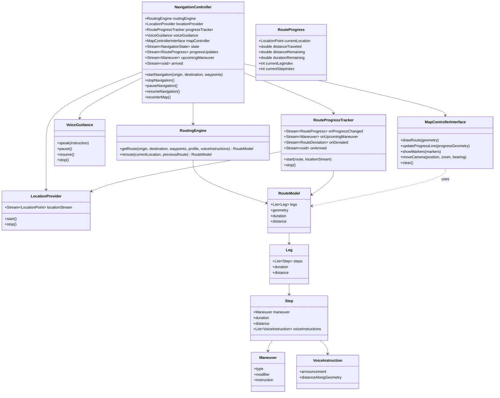

Class diagram: 

Here are a breakdown of **small dev steps** + a **class diagram** sketch for the full system (pure-Dart version). You can use this as roadmap + implementation guide.

---

## Small development steps (milestones)

These are ordered so you can build incrementally, test, then add complexity.

| Step       | What to build / deliverable         | Key tasks & acceptance criteria                                                                                                                                                                                                                                                                                                           |
| ---------- | ----------------------------------- | ----------------------------------------------------------------------------------------------------------------------------------------------------------------------------------------------------------------------------------------------------------------------------------------------------------------------------------------- |
| **Step 1** | Basic routing + map display         | - Implement `RoutingEngine` that calls Mapbox Directions API   - Parse route geometry + steps + maneuvers   - Display route polyline on the map using `mapbox_maps_flutter`   - Show origin & destination markers   - Basic map control (zoom, center)                                                                        |
| **Step 2** | Location & following user location  | - Set up `LocationProvider` using `geolocator`   - Show current location as marker on map   - Implement camera follow mode (i.e. map moves/centers on current position)   - Handle permissions gracefully                                                                                                                        |
| **Step 3** | Route progress tracking + UI data   | - Build `RouteProgressTracker` to track which step / leg you are in   - Compute distance remaining, ETA, distance until next maneuver   - Expose streams or callbacks for progress updates   - Simple instruction UI (text banner) showing next turn, etc.                                                                       |
| **Step 4** | Voice guidance                      | - Use `flutter_tts` to speak instructions   - Use voice instructions from Mapbox (with `distanceAlongGeometry`) to schedule announcements   - Allow pausing / cancelling / resuming voice   - Support basic localization (language) if possible                                                                                  |
| **Step 5** | Deviation detection & rerouting     | - Implement logic to detect off-route (user distance from route geometry exceeds threshold)   - On deviation, call `RoutingEngine.reroute(...)`   - Update route polyline, reset progress & voice/instruction as needed   - UI feedback to user (e.g. “rerouting”)                                                               |
| **Step 6** | UI customization & theming          | - Build default widgets: instruction banner, step list, summary, ETA/distance info   - Define style/theme classes, allow overriding colours/fonts/layout   - Allow custom widget injection (e.g. replace instruction banner with your own)   - Make map route-line styling configurable                                          |
| **Step 7** | Error handling, lifecycles & polish | - Handle errors: routing failures, GPS errors, network offline   - Handle app lifecycle events: background / resume   - Efficiency: throttle location updates, avoid unnecessary redraws   - Unit tests / integration tests for key logic: progress tracking, deviation detection, voice scheduling   - Logging / diagnostics |
| **Step 8** | Optional nice-to-haves              | - Alternative routes   - Traffic-aware route profiles (if Mapbox API supports)   - Offline caching of routes or map tiles (if feasible)   - Voice instruction SSML support or richer markup   - Animations of the route line (e.g. highlighted traveled vs remaining)                                                         |

You might want to split Steps further depending on team size. After each step, ensure API surface is stable so downstream steps (UI etc.) don’t break.

---

### Model classes

* `Maneuver`

  * type (turn, depart, arrive, etc.)
  * modifier (left, right, etc.)
  * instruction text

* `VoiceInstruction`

  * announcement (String)
  * distanceAlongGeometry (double)
  * optional SSML or markup

* `RouteProgress`

  * current location (LocationPoint)
  * distance traveled
  * distance remaining
  * time remaining / ETA
  * current leg / step indices

* `NavigationState` (enum)

  * idle, routing, navigating, paused, arrived, deviated, error